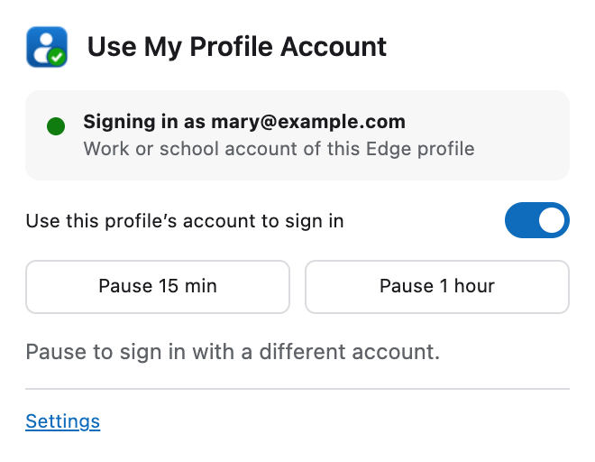
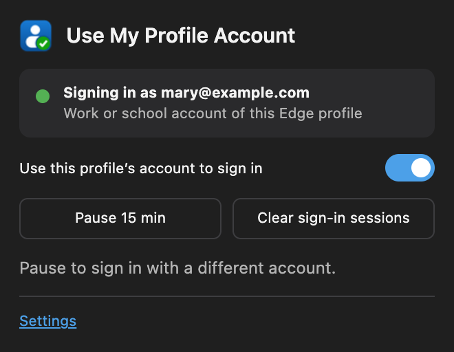

# Use My Profile Account

A Microsoft Edge extension that makes Microsoft sign-ins use **the work or school account of the Edge profile you're using**, instead of the Windows account or an account picker.

On an Entra-joined Windows 11 PC where bob@example.com signs in to Windows:

| Edge profile | Signed in to Edge as | Microsoft 365, Azure, SharePoint… sign in as |
|---|---|---|
| Profile 1 | bob@example.com | bob@example.com |
| Profile 2 | mary@example.com | mary@example.com |

Install the extension in every profile you want this in (a force-installed extension is in every profile). Each copy uses its own profile's account.

<p align="center">
  
  &nbsp;
  
</p>

More screenshots: [settings page](docs/images/settings.png), [paused](docs/images/popup-paused.png), and the [store screenshots](store/).

## How it works

Microsoft's sign-in service chooses the account from the `login_hint` parameter of the sign-in request. The extension adds `login_hint=<profile email>` to sign-in requests using Edge's `declarativeNetRequest` rules. Edge applies the rules itself: the extension never sees the requests, can't read pages and runs no code on them. It reads your profile's email with Edge's `identity` API.

The rules are careful about what they change:

- **Kept as the site sent it:** requests where the site already chose an account (`login_hint`, `username`, `sid`, `id_token_hint`), sign-up requests (`prompt=create`), and anything that isn't the start of a sign-in.
- **Filled in:** an *empty* `login_hint=` is filled in where it stands, never added a second time. The Azure, Entra and Intune portals send an empty one, which is what broke the older [UseMyCurrentAccount](https://github.com/novotnyllc/UseMyCurrentAccount) extension in 2025, and Microsoft rejects a duplicated hint.
- **Covered:** OAuth / OpenID Connect (`/oauth2/authorize`, `/oauth2/v2.0/authorize`), SAML (`/saml2`, including POST binding) and WS-Federation (`/wsfed`) on `login.microsoftonline.com`, `login.microsoft.com`, `login.windows.net` and `sts.windows.net`.
- **Work or school accounts only.** If a profile uses a personal Microsoft account (outlook.com, gmail.com, icloud.com and similar), the extension does nothing in that profile. To tell, it sends only the email's domain (as `user@<domain>`, without cookies) to Microsoft's `userrealm` lookup and remembers the answer for that domain. Until that check succeeds (for example while offline) it does nothing. If an administrator sets `allowedDomains`, those domains count as work domains and no lookup is made.
- **Never touched:** personal-account sign-ins, even in a work profile. That covers `/consumers`, `login.live.com`, requests with `domain_hint=consumers`, and sign-ins that return to consumer sites such as outlook.live.com and account.microsoft.com. Azure AD B2C and Entra External ID (`*.b2clogin.com`, `*.ciamlogin.com`) are also left alone, because they use app-specific accounts.
- **Not in InPrivate.** The extension can't run in InPrivate windows, so InPrivate is always a clean place to sign in as someone else.

Each sign-in gets one extra internal redirect, visible in DevTools as `307 Internal Redirect`.

For security review, see [SECURITY.md](SECURITY.md). For data handling, see [PRIVACY.md](PRIVACY.md).

## Install

**Try it (developer mode):**

1. Download or clone this folder.
2. Open `edge://extensions`, turn on **Developer mode**, click **Load unpacked** and select the folder that contains `manifest.json`.
3. Repeat in each Edge profile.

**Deploy to an organization:**

1. Package the extension from this folder, right after your last change:

   ```powershell
   tar.exe -a -c -f UseMyProfileAccount.zip manifest.json schema.json src icons
   ```

   `tar.exe` is built into Windows 10 and 11. Windows PowerShell 5.1's `Compress-Archive` can write backslash paths that the store rejects. On macOS use `zip -r UseMyProfileAccount.zip manifest.json schema.json src icons -x '*.DS_Store'`. Don't upload an older zip: check that the version in the zip's `manifest.json` matches the source.
2. Publish it on [Edge Add-ons](https://partner.microsoft.com/dashboard/microsoftedge) (Partner Center). Choose **Hidden** visibility if you don't want it to be searchable. See [Store submission notes](#store-submission-notes) for what to enter. Hosting it there is the most reliable option: self-hosted extensions can't always be force-installed on Entra-joined devices that aren't hybrid-joined.
3. Force-install it with Intune: **Devices › Configuration › Create › Windows 10 and later › Settings catalog › Microsoft Edge › Extensions › Control which extensions are installed silently**, with the value
   `<extension ID>;https://edge.microsoft.com/extensionwebstorebase/v1/crx`.
   If you keep extensions off sign-in pages with `ExtensionSettings` `"*": {"runtime_blocked_hosts": [...]}`, give this extension its own `ExtensionSettings` entry: a per-extension entry doesn't inherit `runtime_blocked_hosts` from `"*"`.
4. Start with a pilot group. Test the sign-ins your users depend on, including admin portals, SharePoint, SAML apps and guest (B2B) access, before rolling out widely.

## Using it

Click the toolbar icon to see which account is being used. From there you can:

- **Turn it on or off** for this profile.
- **Pause for 15 minutes or 1 hour** when you need to sign in with a different account. Apps that remember the account you picked keep using it. Other sites go back to the profile account the next time they sign you in, so add sites you always use with a different account (for example a customer's SharePoint) to **Excluded sites**.
- **Open Settings.**

The icon shows the state:

- A green check means it's working.
- A grey pause icon means it's paused, off (with an **OFF** badge), or not used for this account (a personal account, or a domain your organization didn't allow).
- An orange **!** means it needs attention, for example because the profile isn't signed in.

### Settings

| Setting | Default | What it does |
|---|---|---|
| When a site already asks for a specific account | Keep the site's choice | **Always use this profile's account** replaces a hint the site sent for a different account (background renewals in hidden frames keep the site's hint). |
| When a site asks you to pick an account | Skip the picker | Some sites (for example Outlook on the web) always ask for the account picker. Choose **Show the account picker** to respect that. |
| Background sign-ins in hidden frames | On | Also applies to the silent sign-ins apps run in the background. |
| Excluded sites | none | Sign-ins that start from or return to these sites are left alone, for example `dev.azure.com`. |

## Enforcing settings with policy

Settings can be enforced for every profile on a device. Enforced settings are locked in the extension's pages and show as *Managed*. Policy can't set an email, because it applies to every profile. Each profile always uses its own account.

| Policy | Type | Values |
|---|---|---|
| `enabled` | boolean | Turns the extension on or off. Users can't change it. |
| `hintMode` | string | `missing` (keep a site's choice) or `always` |
| `accountPicker` | string | `skip` or `site` |
| `includeFrames` | boolean | Include background sign-ins in hidden frames |
| `excludedSites` | list of strings | Replaces the user's excluded sites |
| `allowPause` | boolean | Show the Pause buttons (default `true`) |
| `allowedDomains` | list of strings | Only act for accounts in these domains, for example `contoso.com` (subdomains included; `@contoso.com` also works). The extension then makes no account-type lookup. Entries that aren't valid domains match nothing, so a list with no valid entry turns the extension off. |

Values live under
`HKLM\SOFTWARE\Policies\Microsoft\Edge\3rdparty\extensions\<extension ID>\policy`.
Booleans are `REG_DWORD` 0/1, strings are `REG_SZ`, and lists are a subkey with `REG_SZ` values named `1`, `2`, `3`…

- **Intune:** edit and deploy [`admin/Set-ExtensionPolicy.ps1`](admin/Set-ExtensionPolicy.ps1) as a platform script running as SYSTEM. Intune's Settings catalog and ADMX import can't write extension policy.
- **Group Policy or testing:** see [`admin/example-policy.reg`](admin/example-policy.reg).
- **Check it:** open `edge://policy` and click **Reload policies**. A value with the wrong type is ignored and won't appear there. The extension ID (lower case) is shown on `edge://extensions`.

## Other settings that affect sign-in

The extension only chooses which account signs in. These Edge and Windows settings decide which profile a site opens in, whether sign-in is silent, and whether the extension can act at all.

- **Profile sign-in** (Settings › Profiles). Sign each profile in to Edge with its work or school account. That's the account the extension uses. On Windows, Edge signs profiles in through Windows' Web Account Manager and uses that account for single sign-on on Microsoft's sign-in pages. The extension adds no single sign-on of its own, and doesn't bypass MFA or Conditional Access, so a password or MFA prompt can still appear.
- **Windows "Access work or school" isn't needed.** Adding an account under Windows **Settings › Accounts › Access work or school** registers the PC with that account's organization, and if that organization has automatic enrollment, enrolls the PC in their device management. Only do it if that organization asks you to (for example because its Conditional Access requires a registered device).
- **Automatic profile switching** (Settings › Profiles). On by default, it opens work sites that you open in a personal profile in your work profile instead. When you choose a profile with the switch icon in the address bar, Edge remembers it under **Profile preferences for sites** (Settings › Profiles › Profile preferences). Either way the site then signs in with that profile's account. If sites keep opening in the wrong profile, turn switching off or remove the site from that list.
- **Default profile for external links** (Settings › Profiles › Profile preferences). Links from Outlook, Teams and other apps open in this profile. In current Edge versions (rolled out from Edge 138) the default on Windows is the *primary work profile*, the one signed in with the account that enrolled the PC (Bob's, on Bob's PC).
- **Allow single sign-on for work or school sites using this profile** (Settings › Profiles › Profile preferences). It only appears in profiles that aren't signed in with a work account. It lets such a profile sign in to work sites with work or school accounts on the device, such as the Windows account. The extension does nothing in those profiles, so this setting alone decides which account is used there.
- **Site access** (`edge://extensions` › Details). The extension needs access to Microsoft's sign-in pages. A user-installed copy does nothing there if its site access is set to *On click*; the popup then offers to allow it. Copies installed by policy can't be limited this way.
- **Remove the old UseMyCurrentAccount extension** if it's installed. Both change the same sign-in requests, and UseMyCurrentAccount is Manifest V2, which Edge is retiring.

Related Edge policies:

| Policy | Effect on this extension |
|---|---|
| `AutomaticProfileSwitchingSiteList` | Chooses the profile for the listed sites (others still follow Edge's own rules). `"No preference"` keeps a site in the current profile; `"*@contoso.com"` opens it in the profile with that account; `"Work"` opens it in the most recently used work profile, which on a shared PC may be someone else's. `GuidedSwitchEnabled` only controls the prompt to switch and doesn't turn switching off. |
| `EdgeDefaultProfileEnabled`, `EdgeOpenExternalLinksWithPrimaryWorkProfileEnabled`, `EdgeOpenExternalLinksWithAppSpecifiedProfile` | Which profile opens links from other apps. |
| `AADWebSiteSSOUsingThisProfileEnabled` | Sets *Allow single sign-on for work or school sites using this profile* for profiles that aren't signed in with a work account. |
| `BrowserSignin` = 0, `RestrictSigninToPattern`, `ConfigureOnPremisesAccountAutoSignIn` | Can leave a profile without a work account the extension can read (profiles signed in with an on-premises AD account give extensions no email), so it does nothing. |
| `ExtensionSettings` | A `runtime_blocked_hosts` entry that covers the sign-in hosts, or the site a sign-in starts from, silently stops the extension. See Deploy step 3. |

## Limitations

- Web apps that get tokens straight from Windows through MSAL.js's platform broker (Web Account Manager) never load the sign-in page, so the extension can't choose their account. Desktop apps aren't affected either.
- The extension only chooses the account. It doesn't bypass MFA or Conditional Access.
- The work-or-school check uses Microsoft's `userrealm` endpoint, which Microsoft doesn't document. If it changes or can't be reached, the extension does nothing until the check succeeds (or set `allowedDomains`, which skips the check).
- A site that sends the hint parameter in unusual letter case (for example `LOGIN_HINT=`) gets a second hint, which Microsoft rejects (AADSTS9000411). Microsoft's own libraries always use lower case. If you hit this, add the site to *Excluded sites*.

## Troubleshooting

- **The popup says "No account to use":** the profile isn't signed in to Edge. Sign in with a work or school account.
- **The popup says "Not used for personal accounts":** the profile is signed in with a personal Microsoft account, so the extension stays idle.
- **The popup says "Checking your account":** the extension couldn't reach Microsoft to confirm the account type (offline, captive portal or proxy). It tries again every minute and does nothing meanwhile.
- **Still seeing the account picker, or the wrong account:** check that the popup shows the right account and isn't paused. Then check which profile the tab is in; see *Automatic profile switching* and *Default profile for external links* above.
- **An app shows an error after sign-in:** add the app's site to *Excluded sites*, or pause, and please report it.
- **See what happened:** open DevTools (F12) › Network on the sign-in page, turn on *Preserve log*, and look for the `307 Internal Redirect` to `login.microsoftonline.com` with `login_hint` added.

## Development

```
manifest.json       Manifest V3
schema.json         Policy (managed storage) schema
src/background.js   Service worker: reads the account, keeps the rules up to date
src/rules.js        Builds the declarativeNetRequest rules (pure, unit tested)
src/settings.js     Settings, policy merging, shared helpers
src/popup.*         Toolbar popup
src/options.*       Settings page
tests/              Rule tests with a small declarativeNetRequest simulator
admin/              Policy script and .reg example
```

Run the tests with `sh tests/run.sh` on macOS. It uses the built-in JavaScriptCore; on other systems, run `node tests/rules.test.js` with Node 22.7 or later. For Edge's regex size limit, `pip install google-re2` adds an RE2 check of every generated rule. After changing code, reload the extension on `edge://extensions`.

## Store submission notes

What to enter in Partner Center:

- **Single purpose:** Makes Microsoft Entra (work or school) sign-ins in an Edge profile use that profile's own account, by adding it as `login_hint` on Microsoft's sign-in pages.
- **Permission justifications:**

  | Permission | Justification |
  |---|---|
  | `identity`, `identity.email` | Read the email of the Edge profile's account, which is added as the sign-in hint so Microsoft signs in with that account. |
  | `declarativeNetRequestWithHostAccess` | Rules add `login_hint` to sign-in requests on the four Microsoft sign-in hosts. The extension doesn't see the requests. |
  | Host permissions (4 Microsoft sign-in hosts) | Where the rules apply. `login.microsoftonline.com` is also used for a cookie-less check that the account's domain is a work or school domain. No other sites. |
  | `storage` | Settings, the pause end time and the work/personal result for the account's domain; reads administrator policy. |
  | `alarms` | Ends a pause on time, re-checks the profile account every 5 minutes, retries a failed check every minute. |

- **Remote code:** No.
- **Data usage:** tick **Personally identifiable information** (the email address, which is sent only to Microsoft's sign-in hosts). Nothing else is collected: no authentication data, web history or website content. The publisher receives no data.
- **Privacy policy URL:** the web link to [PRIVACY.md](PRIVACY.md) in this repository.
- **Store images:** the logo, screenshots and promo tiles are in [`store/`](store/), at the sizes Partner Center asks for.
- **Notes for certification:** Needs an Edge profile signed in with a Microsoft Entra work or school account. With a personal account or an unsigned profile it intentionally does nothing, and the popup says so. To see it work, open https://portal.azure.com in a work profile: DevTools › Network shows a `307 Internal Redirect` that adds `login_hint`.
