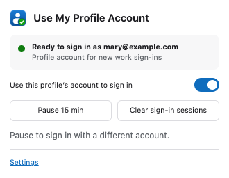
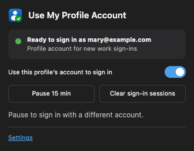

# Use My Profile Account

A small Microsoft Edge extension for Windows 11 that prefers **the work account signed into the current Edge profile** on new Microsoft Entra sign-ins and removes the site's account-picker request.

Give each work account its own Edge profile and install the extension in each one. A profile signed into `mary@example.com` supplies Mary’s account hint, even if Windows uses `bob@example.com`.

<p align="center"> &nbsp; </p>

[Settings screenshot](docs/images/settings.png) · [Store assets](store/) · [Privacy](PRIVACY.md) · [Security](SECURITY.md)

## What it does

- Reads the current profile account with `identity.getProfileUserInfo({accountStatus: 'ANY'})`.
- Uses browser-native rules to replace a site's `login_hint` or `username` with one profile-account hint, removing a conflicting work-domain routing hint.
- Removes `prompt=select_account`, including combinations with `login` or `consent`, while preserving those required prompts.
- Covers OAuth/OIDC, SAML and WS-Federation sign-in navigations on four Microsoft identity hosts. It also supplies the account to background sign-ins that do not already identify an account or session.
- Leaves consumer-only sign-ins and InPrivate windows untouched. No content scripts, cookie access, telemetry, remote code or third-party runtime dependencies.

There are no account-selection settings: using the profile account and skipping the selector is the fixed behaviour. Version 1.2 removes the old `hintMode`, `accountPicker` and `includeFrames` preferences and policies.

## What it cannot guarantee

**This is an account-selection helper, not an identity-enforcement or single-sign-on security boundary.** Microsoft signs in silently only when an eligible session/token is available. Passwords, MFA, consent and Conditional Access can still require interaction. A hint cannot guarantee that Microsoft will never show a selector or let a user choose a different account. See [Microsoft's sign-in parameters](https://learn.microsoft.com/en-us/entra/identity-platform/v2-protocols-oidc).

A website already signed into another account stays signed in until its session ends or you sign out. Requests with `sid`/`id_token_hint`, and account-specific hidden-frame renewals, are deliberately unchanged: switching their identity mid-session could give a running application another account's tokens. Broker-based token acquisition that bypasses the sign-in page, desktop apps, and nonstandard encoded/capitalized account parameters are not controlled by this extension.

Work-domain discovery uses Microsoft's undocumented `userrealm` endpoint, sending only `user@<domain>` without cookies and retaining one domain result. It is a domain eligibility check, not proof that the profile account is an Entra account: a custom domain can have both account types. Failed or unrecognized responses leave the extension inactive. For an enterprise pilot, set `allowedDomains` to your approved work domains to avoid this lookup; that policy is an explicit trust decision, not account-type verification.

## Install and use

1. Download or clone this folder.
2. Open [edge://extensions](edge://extensions), enable **Developer mode**, choose **Load unpacked**, and select the folder containing `manifest.json`.
3. Sign into that Edge profile with the intended work account. Repeat in each work profile. Remove the older UseMyCurrentAccount extension to avoid conflicting rules.

The popup shows which account will be suggested, not the account currently signed into each website. **Ready** means rules are installed; **!** means attention is needed.

- **On/off** and **Pause 15 min** are troubleshooting escape hatches, not different sign-in modes.
- **Clear sign-in sessions** opens Microsoft's [sign-out page](https://login.microsoftonline.com/common/oauth2/v2.0/logout). It does not sign out of the Edge profile or clear all cookies/cached tokens. Microsoft may ask which account to sign out; applications without single sign-out support need their own sign-out.
- **Excluded sites** leave specified sign-ins alone. Leave blank for normal use. Up to 100 hosts, one per line; subdomains are included. Invalid entries are not saved; if Edge cannot compile an exclusion, all rules are disabled and the popup reports an error.

## Edge settings to check

- **Current profile:** [Settings › Profiles](edge://settings/profiles) must show the intended work account. The extension follows the profile in which the tab actually opens.
- **Profile routing:** automatic switching, site preferences and external-link preferences can open a tab in a different profile. Check [Profile preferences](edge://settings/profiles/multiProfileSettings) if that happens. Labels and availability vary by Edge version and organization policy.
- **Site access:** [Extensions › Details](edge://extensions) must permit the four Microsoft sign-in hosts. Restricted site access or `ExtensionSettings.runtime_blocked_hosts` can prevent the rules from running.

The extension does not change Windows accounts or device enrollment. Adding an account under Windows “Access work or school” is not required by the extension.

## Enterprise deployment

Publish the package through [Edge Add-ons Partner Center](https://partner.microsoft.com/dashboard/microsoftedge), then force-install the assigned extension ID with your organization's Edge extension policy. Store certification and your organization's security approval are separate; neither is claimed by this repository. Pilot the actual Windows 11/Entra/Conditional Access configuration and required applications before rollout.

[Microsoft extension installation policy](https://learn.microsoft.com/en-us/deployedge/microsoft-edge-policies/extensioninstallforcelist) explains supported deployment sources and device restrictions.

| Policy | Purpose |
|---|---|
| `enabled` | Enforce on/off; locks the popup switch. |
| `allowPause` | Set `false` to prevent temporary pauses. Default `true`. |
| `excludedSites` | Enforce the exception list; locks its editor. |
| `allowedDomains` | Approved work domains; only matching profile domains act, and discovery is skipped. Subdomains are included. Invalid nonempty lists allow no accounts. |

Windows policy path: `HKLM\SOFTWARE\Policies\Microsoft\Edge\3rdparty\extensions\<extension ID>\policy`. Booleans are `REG_DWORD`; lists are subkeys containing numbered `REG_SZ` values. See [policy script](admin/Set-ExtensionPolicy.ps1) and [registry example](admin/example-policy.reg). Check [edge://policy](edge://policy). Remove retired behaviour policies during upgrade.

The profile is rechecked at worker startup, relevant browser events, popup/settings opening, and every five minutes. Dynamic rules survive worker suspension. An unreported profile change can therefore leave rules stale until the next refresh; this is another reason not to treat the extension as an enforcement boundary. An observed identity change clears the old rules before domain discovery.

## Development and packaging

Runtime source is plain JavaScript in `src/`; `manifest.json` and `schema.json` define permissions and managed settings. Rules have a pure unit-test model plus separate worker lifecycle/privacy tests.

Run `sh tests/run.sh` (macOS with JavaScriptCore; Node 22+ runs the additional worker tests). On Windows with Node 22.7+: `node tests/rules.test.js` and `node tests/background.test.mjs`. Optional `google-re2` enables the static regex-size check. Real Edge must also accept every rule via `isRegexSupported`; none are silently discarded.

After editing an unpacked extension, click **Reload** on [edge://extensions](edge://extensions). Restarting Edge alone can retain cached worker code. Use a fresh test profile when validating a changed build.

Package only runtime files from the tested source:

```powershell
tar.exe -a -c -f UseMyProfileAccount.zip manifest.json schema.json src icons LICENSE.md
```

On macOS: `zip -r UseMyProfileAccount.zip manifest.json schema.json src icons LICENSE.md -x '*.DS_Store'`. Include the MIT license notice. Inspect the ZIP version and contents before uploading. Tests, docs, screenshots and policy scripts are not in the runtime package.

## Store submission

- **Single purpose:** prefer the current profile's work account and skip the Microsoft Entra account selector on supported sign-in requests.
- **Permissions:** `identity`/`identity.email` read the profile email; `declarativeNetRequestWithHostAccess` changes sign-in query parameters on four hosts; `storage` holds preferences/status/domain eligibility and reads policy; `alarms` refreshes the profile, resumes pauses and retries failed discovery. `login.microsoftonline.com` host access also permits the domain-only discovery request.
- **Data disclosure:** disclose the email address as personal information, sent only to Microsoft identity hosts. Publisher receives no data. No authentication secrets, history or page content are collected by this code.
- **Remote code:** none. Publish [PRIVACY.md](PRIVACY.md) as the privacy-policy URL. Assets and suggested text are in [store/](store/).
- **Certification testing:** requires a work-signed-in Edge profile. Supported sign-in navigations show an internal redirect adding `login_hint`; a selector-only prompt is removed. No-account/personal/undiscoverable profiles intentionally stay inactive.
